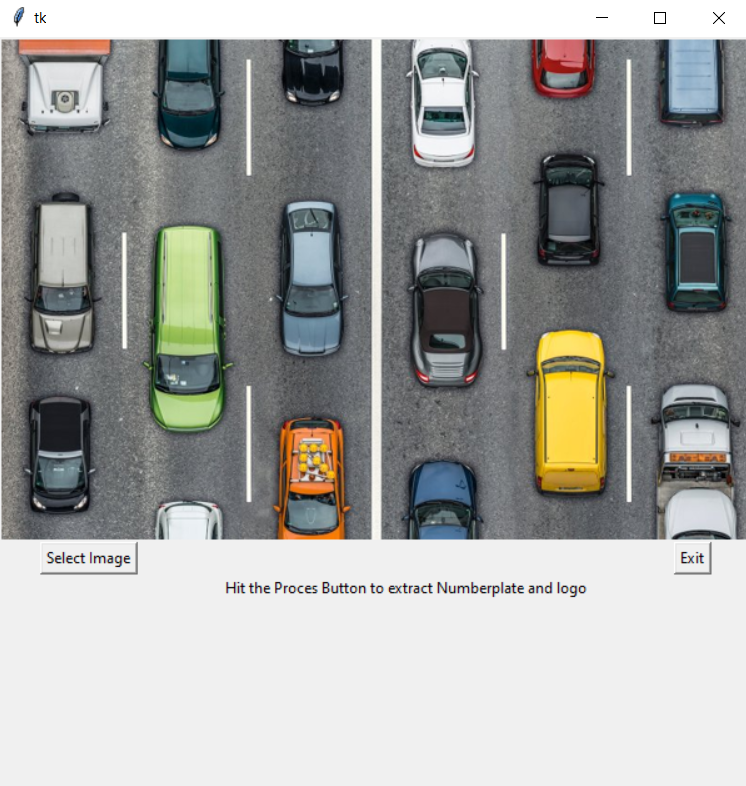

# yolov3_object_detection
Vehicle model and number plate recognizer.

Since i was'nt able to add the weights and classification model for logo reconition, Here i'm explaining how to deal with these two issue, 

Download pretrained yolov3 weights and train for your custom vehicle dataset with yolov3 with given configuration in the Detection for (logo and number plate) and upload in the Detection folder

Design a classification model (i use vgg16 and modified for the output) for the mentioned classes in the file and upload in the main folder

upload a folder with test images and complete your project

I have provided a simple GUI setup also to run this project

Happy run!!!!

